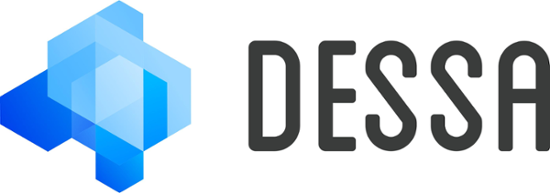

# CSC491/2600

University of Toronto's Capstone Design Course through the [Department of Computer Science Innovation Lab (DCSIL)](https://www.dcsil.ca/student-courses).

This term the course is powered by a cutting-edge Machine Learning Platform called [Dessa](https://dessa.com). We will be using [Dessa's Atlas](https://atlas.dessa.com) to power our startups.

## Table of Contents

- [Course Overview](#course-overview)
   - [Requirements to take this course](#requirements-to-take-this-course)
   - [Required Materials](#required-materials)
- [Who is the lecturer?](#lecturer)
   - [Office Hours](#office-hours)
- [Time and Location](#time-and-location)
- [Schedule](./other_pages/schedule.md)
- [Assignments, Deliverables, Distribution of Grades](./assignments)
- [Presentations](./presentations)
- [Resources and Readings](./other_pages/resources_readings.md)
- [Policies](./policies)
   - [Attendance](./policies/attendance.md)
   - [Communication](./policies/communications.md)
   - [Late Policy](./policies/late_policy.md)
   - [Midterms & Exams](./policies/midterms_and_exams.md)
   - [Plagiarism](./policies/plagiarism.md)
   - [Support and Accomodation](./policies/support_accomodation.md)
   - [Team Grades](./policies/team_grades.md)

## Course Overview

Students will write a software application that implements the business ideas developed in
CSC454/2526 (Business of Software). This course will expose students to the core technologies, ideas, and processes in developing a startup.

Students will be given a theme, in the corequisite course (CSC454), in which to develop a startup. Students are expected to:
- Define their own scope of problem within the theme
- Develop a cohesive plan
- Produce a working MVP (minimum viable product)
- Present their work in various mediums, including written, orally, visually, and through the internet.

Class time will be a mixture of project-focused workshops, lectures, and discussions. The class will be small and very
interactive. Students may hear from guest lecturers from the field.

### Requirements to take this course

There is a co-requisite to CSC491/2600, students must also be enrolled in CSC454/2527 or have taken CSC454/2527 before to take this course.

There is also an application process on [the DCSIL website](https://www.dcsil.ca/student-courses).

### Required Materials

There aren't any _required_ materials persay, but it is highly recommended to bring a laptop to class with a fully functioning developer environment for your project. While not all classes will be workshops, it is recommended to bring your laptop during each class for other uses such as research.

You will also need a [GitHub account](https://github.com/join).

It is recommended to download, install, and set up [Zoom](https://zoom.us/) as this may be used at points through the term.

## Lecturer

Hello! My name is Julian Nadeau. You can reach me at julian.nadeau[at]utoronto.ca.

I am a Senior Software Developer at GitHub during the day. I've also worked in the startup space quite a lot having experienced explosive growth in various roles at Shopify from 2013 to the beginning of this year, including their IPO.
I've run a not-for-profit startup as well, called Code For Kids, that helped teach kids how to code.

You can view my personal website at [https://jnadeau.ca](https://jnadeau.ca) and my [LinkedIn Profile here](https://www.linkedin.com/in/juliannadeau/).

### Office Hours

Office hours are by appointment. Please email me at julian.nadeau[at]utoronto.ca or talk to me in person.

## Time and Location

Class is on Thursdays from 6-9.

Class takes place on the [2nd floor of the Gerstein Science Information Centre, 9 King's College Circle.](https://gerstein.library.utoronto.ca/spaces/dept-computer-science-innovation-lab-dcsil)

Here is a [map](./other_pages/map.md) to help you.

## I don't like something about this course

There's always room for improvement and I'm happy to take any feedback.

Please [submit an issue](https://github.com/dcsil/CSC491/issues/new) on this repo, or preferably make a pull request changing or adding something you don't like.

That said, remember that your changes or concerns aren't guaranteed to be addressed how you want. I (the instructor) have the final say.

If you prefer to speak privately, please email me.
