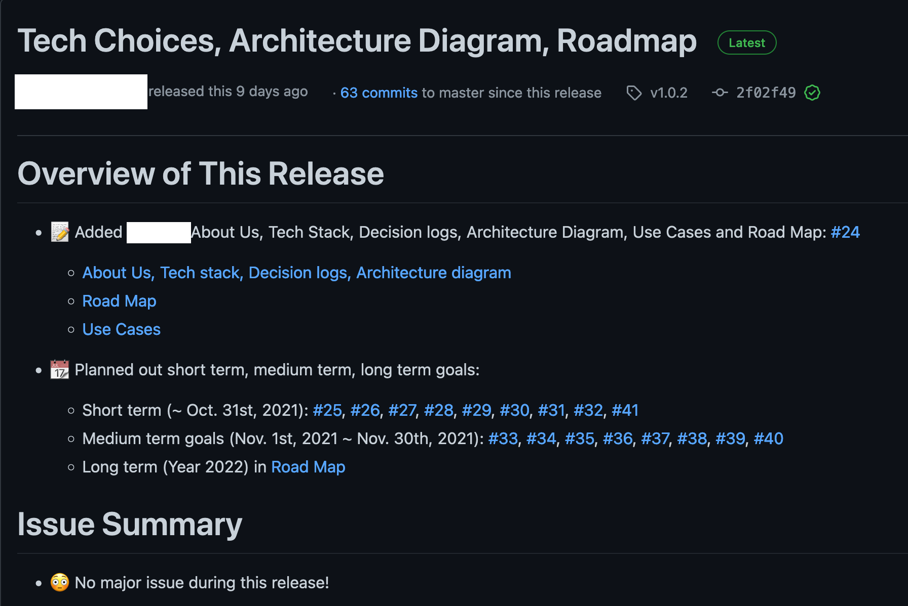

Assignment 4 - UX Research
---

This assignment should be completed alongside Assignment 3 in CSC454/2527. In CSC454 assignment 3, you will be expected to do user research with surveys. This extension to that assignment expects that you have some sort of paper or UI prototype of key functionality with which to engage potential users.

This research should provide you insights into how users work and gain valuable insights on your assumptions.

Furthermore, you should have continued working on your product and made significant progress since CSC491/2600's Assignment 3. Ensure that you roadmap is updated.

---

- [Requirements](#requirements)
- [What is the purpose of this assignment?](#what-is-the-purpose-of-this-assignment)
- [Submission](#submission)
- [Questions or Concerns](#questions-or-concerns)
- [Rubric](#rubric)

---

# Requirements

1. User Research
    - For at least 1 user whom you think may use the product, complete a research study with them using a prototype
    - You must also complete the UX research with the instructor
    - I recommend you complete the research studies at the same time you give the survey in CSC454/2527 A3 to reduce your own work
    - The prototype can be a paper prototype, mockups, an Invision doc, Figma doc, or other form of visual interface
    - Explain to the user what you want them to accomplish, not which parts of the UI to interact with
    - As they work to complete the task, take notes on anything that seems interesting, any mistakes they made, and any questions they ask. I recommend recording the conversation if possible.
    - Include any notes, questions, mistakes, and feedback from the user in the final submission as an appendix
    - Summarize how the research sessions went in the main report. Reference the notes if needed.
    - See the [UX page](./ux.md) for more detail.
2. Roadmap
    - Given the research you performed and the work you've completed since A3, ensure that the roadmap has been updated from your previous assignments in the repo.
    - The roadmap should now give a good sense of what you are planning, and should list goals on at least a monthly cadence, if not bi-weekly (given the short time frame of this course).
    - Make use of GitHub Projects, Issues, and Milestones as you see fit.
    - Include a paragraph in your Release submission explaining how your roadmap has been adapted.
3. Use Cases
    - From feedback collected during the use case reviews, update the use cases submitted in A3 in your `product_research/use_cases.md` file to reflect the MVP scope of each use case.
    - For each use case, create a small `MVP` block with bullet points clearly articulating the capabilities the teaching staff can expect you to complete for the final application submission.
    - Feel free to remove or add entire use cases based on the discussions from the use case reviews as appropriate. You can also leave use cases that won't be included in MVP scope and simply have their `MVP` section say something like 'This use case will not be addressed as part of the MVP'.

# What is the purpose of this assignment?

This assignment helps you understand if your team is implementing something that actually makes sense and respond to early user feedback. This is an exercise often seen in industry.

We expect all CSC491/2600 students to actively participate and have thoughtful discussions. UX lessons should be watched first in order to effectively complete this assignment.

# Submission

You must also [create a release](https://help.github.com/en/articles/creating-releases) on your repo where the code is located.
This will give us a snapshot in time and allow us to grade it. See release body criteria and example below. Assignments without a coherent release body that follow the instructions in this assignment will be rejected and marked 1 day late.

The release does not need to include pull requests or commits from every member. The body does not even need any content, just ensure it is there and appropriately labelled.

One member of your team (could be the team leader, or any other leader) must submit a link to the release in Quercus for 'Assignment 4 - UX Research'. Only one team member needs do this. 

Assignments are always due at 11:59:59pm Eastern Time.

### Release Body

Release bodies must include:
- Direct links to all submitted files
- A paragraph explaining the progress your team has made, and contents of this assignment
- Any additional paragraphs described in the assignment
- Summaries of issues made by your team since last release
- Summaries of changes to your roadmap, architecture, or use cases (changes to use cases must be approved by the instructor).

# Questions or Concerns?

- I don't like part of this assignment
 - File an issue on this repo
- I need to clarify something about this assignment
 - File an issue on this repo
- I need to clarify a question or ask something in private
 - Email the course instructor or email the professor via the email on the homepage / README

# Rubric
 
<!-- RUBRIC START --> 

| Section | Description | Worth |
| --- | --- | --- |
| UX Research  | Interview the class instructor _and_ another individual. The other individual should be someone who would use the product you are building. Includes appendices including notes. These can be rough, but they must show that you asked all individuals approximately the same questions, recorded questions, mistakes, and feedback. Concisely summarizes the results and does not sugar coat the results. | 75.0 |
| Roadmap  | Update roadmap with the changes related to the UX research. Explain the changes and things that you have completed in the release body for the assignment. Paragraph included in release covers progress and answers questions (-100% on this section if not included). | 10.0 |
| Participation & Teamwork (Individual Grade) | Effectively worked as a team member and shared equitable work load during this assignment. Communication was regular and effective & acted in accordance with team principles. | 15.0 |
| | **Total:** | 100 |

 <!-- RUBRIC END -->

`*` It is ok to say "I'm not sure, thank you for bringing that up. I'll research it and get back to you" as long as it's not a large portion of the questions

## Rating Scale

This scale is used for each line of the rubric above.

| Rating | Result |
| --- | --- |
| Outstanding, Thoughtful and thorough | 100% of pts | 
| Strong, Provides some thought | 80% of pts |
| Acceptable, Simple explanation | 60% of pts |
| Insufficient, Little effort was made to give explanations | 40% of pts |
| Unacceptable, No effort was made or the section was missing | 0% of pts |
