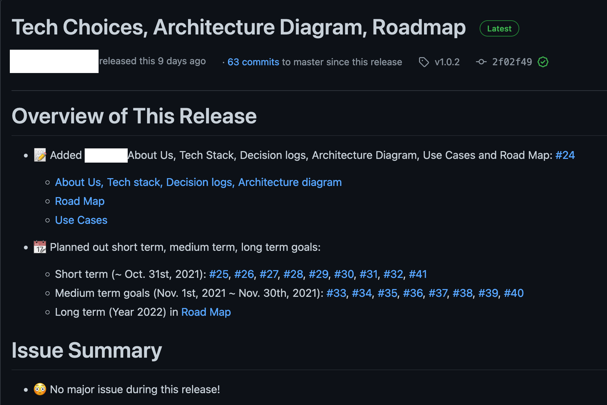

Assignment 5 - Dev Env, Test Infrastructure, & Production Setup
---

This assignment aims to get you set up with best practices in which to build your software. Below are high level goals, followed by in detail requirements.

- You will be required to set up a developer environment, including a bootstrap script.
- You must set up a test infrastructure and a CI System. I recommend using GitHub Actions
- You must deploy a web app to a production environment.
  - Please screenshot the dashboard or system running in your chosen host (Heroku, Azure, Amazon, etc). (-100% of production points if you don't do this). 
  - Include this screenshot in your release submission
- You must set up Sentry (exception tracking) for all supported platforms and logging to an external system (e.g. not just to STDOUT) for web servers 
- It doesn't have to do much, you can deploy and test a Hello World app for now, if needed

---

- [Initial Requirements](#initial-requirements)
- [What is the purpose of this assignment?](#what-is-the-purpose-of-this-assignment)
- [Submission](#submission)
- [Questions or Concerns](#questions-or-concerns)
- [Rubric](#rubric)

---

# Initial Requirements

1. You have created a `service.yml` file in the top directory of your repo. This will help us, and others, see everything available to run and use in your repo.

    <details style="margin-bottom: 1em" markdown="1"><div class="details-box" markdown="1">

    ```yaml 
    tools:
      exceptions: https://...
      logging: https://...
      ci: https://...

    services:
      production: https://...
      production_dashboard: https://
      staging: ...

    docs:
      getting_started: https://...
      
    commands:
      bootstrap: script/bootstrap
      database:
        create: bin/rails db:create
        migrate: bin/rails db:migrate
      server: bin/rails server
    ```

    This should serve as an example. These kinds of files can help you debug, record links to docs, services, tools, and more.

    While this is less useful with one app, in an organization with many apps this can be crucial to remembering and finding information.

    <h4>Examples:</h4>

    - [F2019 Team Klutch - Javascript](https://github.com/dcsil/klutch/blob/master/app/service.yml)
    - [Team App - Rails/Ruby](https://github.com/dcsil/learn_software_app/blob/master/service.yml)

    </div></details>

2. You have a `script/bootstrap` script, `bin/bootstrap` script, or similar, available and able to be run on Unix systems (Sorry Windows Users).
  - This should install dependencies if needed like Postgres, MySQL, Redis, etc
  - This should install any languages required
  - This should install any packages like Rubygems, Node Packages, etc
  - Docker Compose or Docker is ok to use

    <details style="margin-bottom: 1em" markdown="1"><div class="details-box" markdown="1">

      Write a script named `script/bootstrap`, it should setup much of your system for you.

      It is fine if the script targets one operating system (mac, linux, or windows).
      
      Make note of this script in the README of your app. If you have a getting started guide, this can be in there but you should make sure that that guide is mentioned in the README.
      
      Docker and Docker Compose is a good option here

      <h4>Examples:</h4>

      - [Javascript and Node](https://github.com/integrations/jira/blob/master/script/bootstrap)
        - this uses `brew bundle`, which comes from https://brew.sh/
        - `brew bundle` installed everything from the [`Brewfile`](https://github.com/integrations/jira/blob/master/Brewfile)
      - [Ruby and Rails, Team App](https://github.com/dcsil/learn_software_app/blob/master/bin/bootstrap)
        - this uses some custom install scripts to try and minimally impact the system
        - it installs all languages, dependencies, and databases that it needs
        - then it creates and migrates the database so it's ready to use

    </div></details>

3. You have a test infrastructure set up and listed in your `service.yml`. You should be able to run _exactly_ what you list in your `service.yml` file to run your tests. It is ok if you only test a `hello world` app for now.
4. You have CI setup to run your tests from (3).


    <details style="margin-bottom: 1em" markdown="1"><div class="details-box" markdown="1">

      I recommend [GitHub Actions CI](https://help.github.com/en/actions/automating-your-workflow-with-github-actions).

      <h4>Examples:</h4>

      - [Javascript example for GitHub Actions CI](https://github.com/integrations/jira/pull/295)
      - [Node example for GitHub Actions CI](https://github.com/dcsil/klutch/blob/master/.github/workflows/nodejs.yml)
      - [Ionic example for GitHub Actions CI](https://github.com/dcsil/klutch/blob/master/.github/workflows/ionic.yml)
      - [Ruby example for GitHub Actions CI](https://github.com/dcsil/learn_software_app/blob/master/.github/workflows/ruby.yml)

    </div></details>

5. You must have your app available online (if a web app) via a public URL. If you are not making a web app, you must have your app available via a compiled artifact in a GitHub Release for the teaching staff to install. We should *not* have to do anything than open the install file.

    <details style="margin-bottom: 1em" markdown="1"><div class="details-box" markdown="1">

      You can deploy to Heroku really easily with Ruby, Javascript, Python, Go, PHP, and other languages.
        - You only need the hobby dyno
        - I would recommend Postgres as there is a free hobby database you can use
        - This is not good to host your machine learning experiments
        - It is included in your [GitHub Student Pack](https://education.github.com/pack)

      - [DigitalOcean](https://digitalocean.com), [Amazon AWS](https://aws.amazon.com/), and [Microsoft Azure](https://azure.microsoft.com/en-us/) are other options and also included

    </div></details>

6. You must record any decisions, changes, and updates to your Stack Decisions and update your Architecture diagram from A3. Include a paragraph in your Release submission outlining the changes to your roadmap, including (high level) what you have completed. Answer "are you on schedule?"

# What is the purpose of this assignment?

This assingment helps you set up a software project in a scalable way. It is likely your first time implementing much of these aspects of a project, and it may seem tedious (it is). However, these are crucial to helping your team grow and will act like another person (catching all your bugs with tests!). You are encouraged to write tests along the way to help make sure you are not breaking your app.

We expect all CSC491/2600 students to actively participate and have thoughtful discussions. Technology lessons should be watched first in order to effectively complete this assignment.

# Submission

You must [create a release](https://help.github.com/en/articles/creating-releases) on your repo.
This will give us a snapshot in time and allow us to grade it. See release body criteria and example below. Assignments without a coherent release body that follow the instructions in this assignment will be rejected and marked 1 day late.

Assignments are always due at 11:59:59pm Eastern Time.

Second, you must submit the release on the LearnSoftware application. You can find the submission location here: <https://learnsoftware.engineering/my_assignments>

### Release Body

Release bodies must include:
- Direct links to all submitted files
- A paragraph explaining the progress your team has made, and contents of this assignment
- Any additional paragraphs described in the assignment
- Summaries of issues made by your team since last release
- Summaries of changes to your roadmap, architecture, or use cases (changes to use cases must be approved by the instructor).


 
# Questions or Concerns?

- I don't like part of this assignment
 - File an issue on this repo
- I need to clarify something about this assignment
 - File an issue on this repo
- I need to clarify a question or ask something in private
 - Email the course instructor or email the professor via the email on the homepage / README

# Rubric
 
<!-- RUBRIC START --> 

| Section | Description | Worth |
| --- | --- | --- |
| `service.yml`  | Is present, error-free, and fully filled out. See notes below for more details on how to validate. | 10.0 |
| `script/bootstrap` or similar  | Functions on Unix systems (Linux and/or MacOS). Application is fully ready to run after running the script (dependencies installed, database install and setup, etc). The only exception is when you need to get credentials for something like a 3rd party API, that can be a different step.  See Notes Below | 25.0 |
| Testing and CI setup  | Test harness works and can be run from a single command listed in the service.yml file. CI is running and is passing. If the test command is not listed in the service.yml, 0 pts will be awarded for this section. If the command fails to run before tests are executed, 0 pts will be awarded for this section. | 20.0 |
| Production / Builds  | Application is available from the web (e.g. Heroku, AWS, DigitalOcean, Azure, etc), as a mobile application via Microsoft App Center, or a GitHub Release otherwise.<br>Exception tracking via Sentry and Logging is set up. See Notes Below | 20.0 |
| Roadmap  | Roadmap and Stack Decisions are updated with any new decisions and/or changes. Paragraph included in release covers progress and answers questions (-100% on this section if not included). | 10.0 |
| Participation & Teamwork (Individual Grade) | Effectively worked as a team member and shared equitable work load during this assignment.<br>Communication was regular and effective & acted in accordance with team principles. | 15.0 |
| | **Total:** | 100 |

 <!-- RUBRIC END -->

## Notes

- `service.yml`: This file must be in a specific format and be submitted with no errors. See <https://learnsoftware.engineering/documents/3> for more details on this file.
- `script/bootstrap`: You can run automated "bootstrap checks" from your repo's profile in the Learn Software app. This functionality will run your script on Mac and Linux. It is not required for it to pass on both, but you should aim for it to pass on at least one of the systems.
- Sentry Sign in: See <https://learnsoftware.engineering/documents/17>
- Logging setup: This is a logging pipeline, like AWS CloudWatch or Sumologic on Heroku
- NOTE: You must provide a screenshot of the dashboard running your application or releasing the app if applicable. Failure to do so will result in a 0 on the production section, or -50% if you can provide one late.
- Credentials:
  - These should never be hardcoded and shared. In practice this would lead you to having conflicts (if you shared a database credential), rate limit issues / security issues (if you shared API keys), etc.
  - If your app needs credentials to start, then you should provide fake ones
  - If you want to share a database, for example, **don't**. This is something you will lose marks for. Install the database software (Mongo, Postgres, etc) as part of bootstrap and create what you need locally
  - In the case that you have some 3rd party credentials (for example, the LearnSoftware App uses GitHub credentials), you can make your app start with fake credentials and include instructions in the README.md file for credentials.
  - Consider using the `dotenv` pattern (`.env` file contains all your env vars and secrets, search `dotenv` and your language of choice for packages) where you provide a `.env.example` file that you copy over to `.env` on bootstrap if an existing `.env` does not exist. This file contains default credentials to thing like a default mongodb instance on your local machine, fake credentials, etc.


## Rating Scale

This scale is used for each line of the rubric above.


| Rating | Result |
| --- | --- |
| Outstanding, Thoughtful and thorough | 100% of pts | 
| Strong, Provides some thought | 80% of pts |
| Acceptable, Simple explanation | 60% of pts |
| Insufficient, Little effort was made to give explanations | 40% of pts |
| Unacceptable, No effort was made or the section was missing | 0% of pts |
