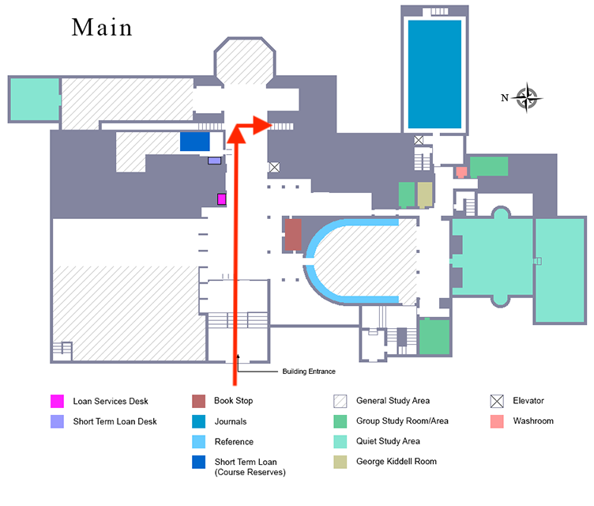
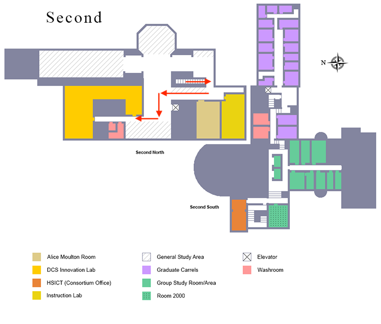

Map
---

Class takes place on the [2nd floor of the Gerstein Science Information Centre, 9 King's College Circle.](https://gerstein.library.utoronto.ca/spaces/dept-computer-science-innovation-lab-dcsil)

Here is a map of the building:

#### 1st Floor

#### 2nd Floor
