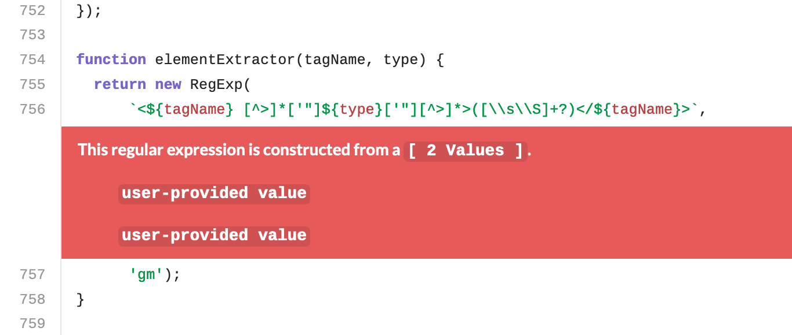

# Best Practices, Technology, and Tooling

## CSC491, University of Toronto

---

# What are best practices?

> commercial or professional procedures that are accepted or prescribed as being correct or most effective.

---

# What are best practices?

There are so many opinions on this topic that none of them are right. This lecture will cover some pro-tips on how to naviate this field

---

# High Level Agenda

1) We will not go in depth on any topic as there are many many options and that would not be feasible
2) I intend to introduce you to the concepts and provide some examples
3) You should leave here understanding a breadth of options and understand new concepts
4) I will help you evaluate and pick options if required for your projects
5) I can answer questions based on my own experiences and opinions, but remember these are not the "correct" solution

---

# High Level Agenda

- Languages & Frameworks
  - Ruby, Python, Javascript, PHP, Java, C, C++, Rust, Golang, R, etc
- Testing
  - The different types of tests
  - When to reach for what
  - Code Coverage
- Linting & Semantic Analysis

---

# High Level Agenda

- Technologies
  - Continuous Integration and Deployment (CI/CD, Circle, Travis, GitHub Actions)
  - Databases (MySQL, Postgres, etc)
  - Caching (Redis, Memcache, etc)
- Local Developer Environments
  - Developer Productivity

---

# Preface

Each of the following topics evolve with your company. What you need now does not match what you need in the future. This is a constantly changing area.

If you're lucky, you'll end up with a full department dedicated to these areas

---

# Languages

- Examples include:
  - Ruby
  - Python
  - Javascript
  - PHP
  - Scala
  - R
  - C
  - C++
  - Rust
  - Golang
  - Java

---

# How to pick a Programming Language

1) What are they good at? Web? System? FED? OS?
2) Is the community and the community tooling good?
3) Can you hire for it? aka is it a top language

---

# Top Languages

GitHub Report showing top languages over time:


---

# Fastest Growing Languages

GitHub Report showing fastest growing languages:


---

# Languages

- Examples include:
  - Ruby : Ruby on Rails, System Scripts
  - Python : Django, Machine Learning
  - Javascript : Node, React, Vue, Angular, .....
  - PHP : Laravel
  - Scala : Machine Learning and Data Analysis
  - R : Machine Learning and Data Analysis
  - C : Interacting with system components
  - C++ : Games, Interacting with system components
  - Rust : Multi-threading, quick processing
  - Golang : Multi-threading, quick processing
  - Java : Embedded frameworks

---

# Testing

## Different Types of Tests

This list is not exhaustive.

#### Functional testing : Unit Tests

A test written on a module of code or software component. Tests that inputs gives expected outputs.

```ruby
def add(a, b)
  a + b
end

def test_add
  assert_equal 5, add(2, 3)
end
```

---

# Testing

#### Functional testing : Integration Tests

Test the integration of multiple components to ensure they work correctly (e.g. calling API goes to controller and renders properly)

```ruby
class MyController
  def index
    render json: Person.all.to_h
  end
end

def test_index
  get "/my_controller.json"
  assert_response :success
  assert_equal [{ name: "Jane Doe" }], JSON.parse(response.body)
end
```

---

# Testing

#### Functional testing : Smoke or Acceptance Tests

Manual validation of a product or software by humans. Sometimes performed by dedicated "testers"

---

# Testing

#### Functional testing : UI, Screenshot, Visual Regression Tests

The use of automated image diffing software to determine if an image changed. Usually used by generating a screenshot of your rendered software.


---

# Testing

#### Functional testing : Regression Tests

Can refer to a full scale manual smoke test of an app, or an automated test targeting a specific bug

```ruby
def test_person_name
  assert_equal "Jane Doe", @person.name
  # There was a bug that wouldnt correctly render accented latin characters
  assert_equal "Sébastien Trudeau", @french_person.name

  # There was a bug that wouldnt correctly render Chinese characters
  assert_equal "孫載之", @chinese_person.name
end
```

---

# Testing

#### Functional testing : System Tests

Automated testing of the system as a whole. Tend to be slow, but especially useful for critical code paths like sign in

```ruby
def test_sign_in_flow
  # Server is started automatically
  go_to "/sign_in"

  click "Email"
  type "jack@example.com"

  click "Password"
  type "123456a!"

  click "Sign in"

  assert_text "Welcome jack@example.com"
end
```

---

# Testing

#### Non-Functional testing : Performance Tests

Testing of the systems performance. Can use dumps of the garbage collection, current system state, determine how long something takes

```ruby
def test_an_expensive_method
  t = Time.now
  do_an_expensive_thing
  delta = Time.now - t
  assert delta < 10 # 10 seconds
end
```

---

# Testing

#### Non-Functional testing : Load Tests

Test how much load a system can take on various paths. E.g. can I send 1 million requests per minute? per second? to <action>


---

# Testing

#### Non-Functional testing : Security Tests

The use of pentesting, hacking, semantic analysis and other methods to determine if unauthorized access can be gained into a system. This can be XSS, SQL Injection, Memory Buffer Leaks, and more.

---

# Testing

## Code Coverage

> measure used to describe the degree to which the source code of a program is executed when a particular test suite runs

Aka when I run my tests, what percentage of lines of code in my app are hit?

---

# Testing

## Code Coverage

What percent coverage should you aim for?

---

# Linting

> lint, or a linter, is a tool that analyzes source code to flag programming errors, bugs, stylistic errors, and suspicious constructs.

```shell
~/src/github.com/dcsil/team-app(master) ➜ rubocop
Inspecting 61 files
...........C.C................C..................CC.CCC...WC.

Offenses:

app/models/student.rb:24:42: C: Layout/ExtraSpacing: Unnecessary spacing detected.
  attr_accessor :skip_password_validation  # virtual attribute to skip password validation while saving
                                         ^
```

---

# Linting

- Saves time on the boring stuff (who wants to debate how many spaces to put after a `{`?)
- Consistent Code. Code is your UI. This makes your devs faster because the code is easier to read
- Can catch bugs

---

# Linting

Can also help a developer do the "right" thing!

Linting can ensure proper use of methods in OSS repos, for example.

---

# Semantic Analysis

> Semantic analysis or context sensitive analysis is a process in compiler construction, usually after parsing, to gather necessary semantic information from the source code.

Includes such things as type checking too.

---

# Semantic Analysis

- Catch bugs
- Catch security issues



---

# Continuous Integration (CI)

### Overview of how it works

When code is pushed to a remote repository, a system picks up the changes, clones them, runs the test suite, and reports the result to the code.

---

# Continuous Integration (CI)

### Parts of a CI System

The basic parts of a CI system are:

1. Event System
   - Receives events from some remote source indicating a code change
2. Scheduling system
   - Schedules the job to be run
3. Coordinator
   - Coordinates workers to run a job. Sometimes will check out the code and create a cached setup for the workers.

---

# Continuous Integration (CI)

### Parts of a CI System

4. Workers
   - Checks out the code if not done in (3) and sets it up. Runs the test suite (or part of it)
5. Reporter
   - Aggregates any results and reports back to the source of the code change

---

# Continuous Integration (CI)

### Parts of a CI System

- We also need a UI to see the CI running and stream logs in real time
- We can sometimes need a test flakiness* detection system

`*` test flakiness occurs when a test, that should pass, fails some of the time for unrelated reasons. This could be due to performance issues of the system, time based issues, or something else unknown.

---

# Continuous Integration (CI)

#### Setup time

- As your test suite grows so does the time required to run it.
- To combat this people often split their tests between multiple workers.
- Each of those workers has some fixed set up time.

---

# Continuous Integration (CI)

#### Setup time

- E.g. If you have 20 workers that run 30 minute of tests each but each takes 3.5 minutes to setup, then it still takes 4 minutes. It would be just as cost effective and almost the same time to halve the workers in this case.
- Work on reducing set up time by prebuilding an image, sharing a cache between builds (of packages for example), or having one setup done in a coordinator

---

# Continuous Deployment (CD)

- Fast, debuggable deploy
- Somewhere everyone can see, so many can debug if problems
- Coordinated deploys are easier

---

# Continuous Deployment (CD)


---

# Continuous Deployment (CD)


---

# Databases

- Examples include:
  - MySQL
  - Postgres
  - MongoDB
  - CockroachDB

---

# Databases

- Choose one based on industry, E.g. what part of ACID is important to you?
  - MongoDB is know to have poor data durability for example, so would be poor for Fintech or other industries where data durability is important
- What expertise do you have in the company?

---

# Caching

- Examples include: Redis and Memcache
- Depends on your use case.
   - Example: Redis is good for smaller datasets and can use 1 core
   - Example: Memcached is better on a larger dataset, worse per-core performance, but can use multiple cores

---

# Local Developer Environments

- How will you run your app locally?
- How will the next person?
- What is the experience like running your app locally?

---

# Local Developer Environments

- Running your app locally often starts as a set of instructions in a doc somewhere
- Eventually it makes its way into an automated script when other people start wanting to run your software
- Many people eventually make Docker containers out of it
- Then they realize they need 10 Docker containers to run stuff locally and need to network into the Docker container to change files

---

# Local Developer Environments

- Not an easy task. Just as hard as production.
- Docker-Compose is a good start, may need to write code outside of the container and sync in?
- In Cloud options becoming more viable

---

# Local Developer Experience

- The local developer experience should be something you don't take for granted.
- While saving a few minutes of time on a script or task might seem meaningless, imagine the time saved when you have to do that task 100 times. Imagine the time saved when 100 people have to do the task 100 times.
- [I have written a lot about this here](https://www.notion.so/jnadeau/Developer-Productivity-37a01aed957a44b8ad20cb2a297d6c01)

---

# Resources

- [Types of Software Testing](https://www.softwaretestinghelp.com/types-of-software-testing/)
- [Visual Regression Testing](https://learn.visualregressiontesting.com)
- [Locust.io](https://locust.io/)
- [Lint (Software)](https://en.wikipedia.org/wiki/Lint_(software))
- [LGTM from Semmle Example](https://lgtm.com/projects/g/ampproject/amphtml/snapshot/14823e4d72668cf89932b8ede8895830a18cd3f9/files/build-system/app.js?sort=name&dir=ASC&mode=heatmap)
- [Redis vs Memcached](https://medium.com/@Alibaba_Cloud/redis-vs-memcached-in-memory-data-storage-systems-3395279b0941)
- [GitHub report on top languages](https://octoverse.github.com/)
- [Developer Productivity](https://www.notion.so/jnadeau/Developer-Productivity-37a01aed957a44b8ad20cb2a297d6c01)
