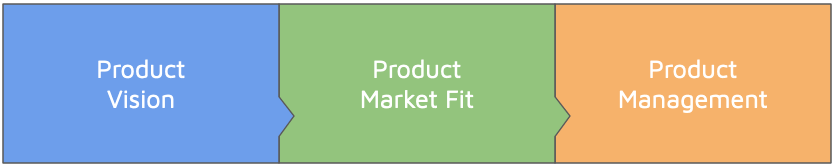
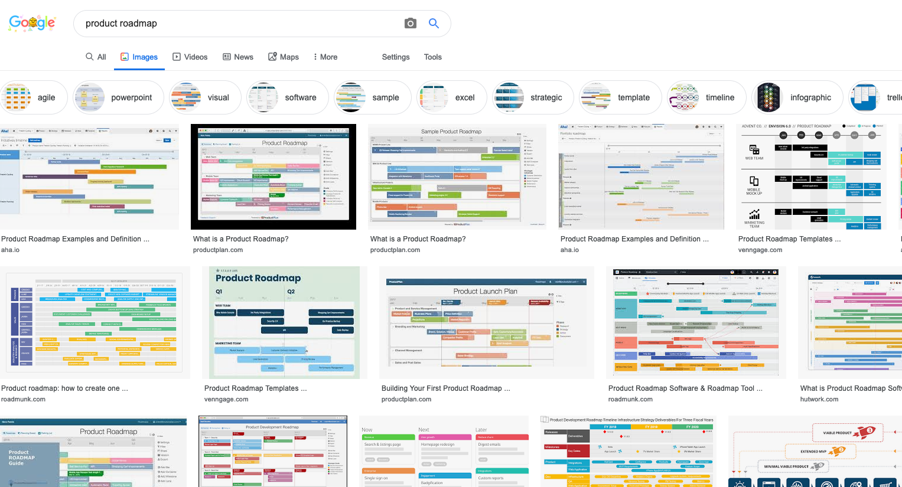

# Product & Market Fit

## CSC491, University of Toronto

---

# I asked a question on Twitter...

---

# And I got some interesting responses...

---

# What does this mean?

It means that you need to be intentional in figuring out how your product fits into the market. Do your research and position. Do not rely on chance.

---

# What is Product?

There's no shortage of results online...

---

# Give me the Tl;Dr

There are many areas of product in any given company. There's likely no exhaustive list because everyone does it a little bit differently.

The general idea is that you have a product to sell. How do you know it's the right product? How do you know if it's good? Are there customers for this product? Will they be willing to pay money? If not, who will pay money?

---

# Let's focus on 3 topics for discussion

---

# Let's focus on 3 topics for discussion

While product can encompass a lot more, we're going to talk about the basics: A vision that inspires your company, informs your product market fit, and what to do after you have all that, manage that product.

---

# 1. Vision

---

# 1. Vision

The North Star has guided travellers for centuries. It is a reference point for which to position and "advise" your path forward.

---

# 1. Vision

- Core "mantra" of your company's product
- A "North Star" to help guide your decisions
- Tells us where to steer the ship and gives us directions
- Can also be called a "purpose" or "mission"

---

# 1. Vision

## Examples of North Stars

### AirBnB

- **Purpose**: Airbnb and its community wants to create a world where Anyone can Belong Anywhere
- **Metric**: Number of Nights booked

---

# 1. Vision

## Examples of North Stars

### Medium

- **Purpose**: Ideas and perspectives you won’t find anywhere else
- **Metric**: Total time spent reading

---

# 1. Vision

## Examples of North Stars

### Quora

- **Purpose**: Quora’s mission is to share and grow the world’s knowledge
- **Metric**: Number of questions answered

---

# 1. Vision

## Examples of North Stars

### Intercom

- **Purpose**: The world’s first customer messaging platform for business growth
- **Metric**: Number of customer interactions

---

# 1. Vision

## Examples of North Stars

### Facebook

- **Purpose**: ~~To make the world more open and connected~~ Give people the power to build community and bring the world closer together
- **Metric**: Monthly active users

---

# 1. Vision

## Examples of North Stars

### Shopify

- **Purpose**: Make commerce better for everyone
- **Metric**: Number of Merchants / Gross merchandise volume

---

# 1. Vision

These examples all show a _purpose_, a _drive_ to exist.

Their purpose isn't just to "make money". That can't really be your purpose unless you're a bank. It can be a goal, but not your main driver.

---

# 2.Product Market Fit

## Finding your Product

> You don't find customers for your products. You find products for your customers.

_~ Seth Godin, author and former .com executive (https://seths.blog/2009/12/first-organize-1000/)_

---

# 2.Product Market Fit

---

# 2. Product Market Fit

- Finding product market fit is very difficult
- There is no exact science
- However, entrepreneurs work like scientists: use scientific method

---

# 2. Product Market Fit

## How do I know I got it?

Let's start with when you _don't_ have it.

- Customers aren't really understanding the value proposition
- Word of Mouth isn't happening
- Usage isn't growing
- Sales take a long time

When you do have it, many of the bullet points above are inversed. Also, sales and support staff become in high demand - and not because your product is complex/crappy, but because there's such an influx in customers!

---

# 2. Product Market Fit

You have a few components you need to work with. The major one is the market.

- If you have a great product, but no market, then you'll fail
- If you have a great product, there is a market, but no one wants to pay, you'll go bankrupt
- If you have a bad product, but there is a market and no competition, you may succeed but will be easily disrupted
- If you have a great product, an in-demand market, and people willing to pay - then you have a recipe for success. Unless...

---

# 2. Product Market Fit

The last component we'll talk about is the team. If you have a great product and all the stars align in the market, but you have a team without expertise, a lack of leadership, or if you fight - you'll fail just the same.

Your team is highly valuable and getting the right people is important. We'll talk more about this in another lecture.

---

# 2. Product Market Fit

One thing to note, that's fairly important, is that you can't determine product market fit once and then assume it remains true.

You need to *always* be validating your product market fit. In the later stages of your company, this will be through product management, UX, Marketing, analytics, data, and other areas.

---

# 3. Product Management

Once you have a vision, you've determined product market fit, and you're building your product... how do you make sure you stay true to the product's vision? How do you determine if a feature is valid and useful? Provides value?

The answer is product management.

---

# 3. Product Management

## What is product management?

Product Management is a craft, just like development, design, user research, writing, and the many other crafts you'll need throughout the lifetime of your company.

---

# 3. Product Management

## What is product management?

The product manager (PM for short) is typically responsible for the initial and ongoing strategy of a feature, feature roadmaps, and ongoing feature definition for that product or product line.

---

# 3. Product Management

People at the top of the product organizations are responsible for the vision of the entire company. Companies may have many projects, but they must align on a core vision and somehow fit together.

As you get further down the management chart, people are in charge of the product vision of smaller pieces with a product manager being in charge of a team's vision. 

---

# 3. Product Management

Despite the hierarchy, these people all must remain aligned and often discuss and influence direction.

---

# 3. Product Management

This type of organization _does not mean_ that engineering, design, etc cannot take part in product planning. These people are all invested in the product too. The Product Management's role is to simply ensure the plans of the company remain aligned with the vision.

---

# Product Roadmaps

You've been working on these throughout the term for our assignments, what have you learned?

What works? What doesn't?

---

# Product Roadmaps

Most people tend to default to a product roadmap that is based solely on time.

_Section inspired by [this Twitter thread](https://twitter.com/simplybastow/status/1168531672335343616) & [this article](https://www.mindtheproduct.com/2018/03/growing-up-lean/) from [Janna Bastow](https://twitter.com/simplybastow) (CEO of [ProdPad](https://twitter.com/ProdPad)), including the images_

---

# Product Roadmaps

Time-based roadmaps make sense at first, but as time goes on you have no idea what is actually going to happen. Now you're making stuff up and putting arbitrary limits.

---

# Product Roadmaps

- You don't actually know how long things will take until they're closer in the horizon
- External factors and stakeholders can cause a disruption in your schedule
- You assume that every feature will work 100% the first time, this is not usually the case
- It's a ton of assumptions!

---

# Product Roadmaps

## So what now?

---

# Product Roadmaps

You're welcome to use a timebased roadmap on a short term (few weeks to 6 weeks), but for the rest:

1. Just like your company's vision, you need a vision for a product / feature. Find one.
2. In terms of outcome, make sure that vision aligns with your company's north star.
3. Use "time horizons"

---

# Product Roadmaps

_Image borrowed from https://www.mindtheproduct.com/2018/03/growing-up-lean/, they maintain copyright of the image_

---

# Resources

## Articles

- [How AirBnB found its purpose on Medium](https://medium.com/@douglas.atkin/how-airbnb-found-its-purpose-and-why-its-a-good-one-b5c987c0c216)
- [North Star Metrics answer by Carolyn Rose Kick on Quora](https://www.quora.com/What-is-North-Star-metric-for-startups)
- [North Star Metric Article on Forbes](https://www.forbes.com/sites/groupthink/2017/04/11/why-our-startup-needed-a-north-star-metric-and-how-we-found-it/#23e344344e40)
- [Product or Sales Article on Acquire.io](https://acquire.io/blog/startups-product-or-sales/)
- [What is Product Vision? on Aha.io](https://www.aha.io/roadmapping/guide/product-strategy/what-is-product-vision)
- [Why startups fail on Forbes](https://fortune.com/2014/09/25/why-startups-fail-according-to-their-founders/)
- [Odds of becoming a Unicorn are about 1%, and more insights on CBInsights](https://www.cbinsights.com/research/venture-capital-funnel-2/)
- [Growing up Lean](https://www.mindtheproduct.com/2018/03/growing-up-lean/)

---

# Resources

## Books

- [Shape Up, a Product/Project Management Guide by Basecamp](https://basecamp.com/shapeup)

## Twitter

- [Tweet by Janna Bastow](https://twitter.com/simplybastow/status/1168531672335343616)
