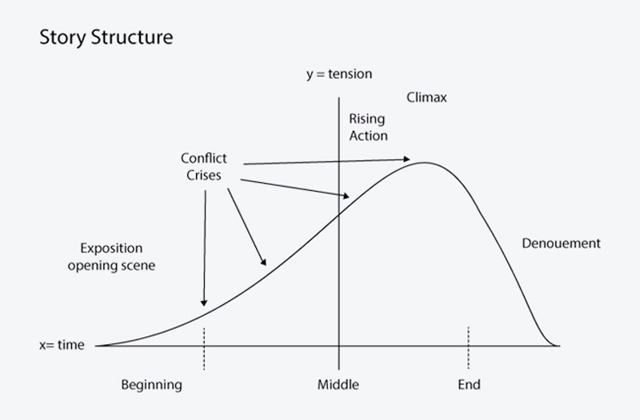

# Story Telling

## CSC491, University of Toronto

---

**Everything is a story. Storytelling has been with humanity since the dawn of humanity.**

---


In the dawn of humanity, we saw stories told through cave drawings where we often saw great hunts.

---


We continued to see these practices through ancient Egyptian hieroglyphics. This practice has remain unchanged. We are all storytellers, whether you realize it or not.

---

# What is a Story?

---

# What is a Story?

The author Randall Jarrell, describes a story as being a chain of events that begins at one place and ends at another “without any essential interruption.”

Mark Twain agreed. His first rule of writing was “that a tale shall accomplish something and arrive somewhere.”

---

# What is a Story?

So, a story goes somewhere.

It follows, with purpose, one or more characters through a series of events.

By the end, it arrives at a target destination, fulfilling its reason for having been told.

---

# What is a Story?

The most important part is that a story intends to **arrive at a target destination.** It has an intent in mind.

---

# What is a Story?

This is cool and all, but what the heck does this mean? We're programmers, not writers.

Well, think about it for a second.

---

# What is a Story?

When you consider a story is a "set of events (or descriptions of events) that lead to a target destination", then many things fit that description. Things like:

- This lecture
- Oral communications
- A comment online
- A text message / conversation
- An email
- An assignment
- Describing your code change to someone so they can review it
- The code itself
- Literally anything that communicates anything

---

# What is a Story?

## How to get to the Target Destination: Parts of a Story

---

## How to get to the Target Destination: Parts of a Story


---

## How to get to the Target Destination: Parts of a Story


You may have seen a version of this in elementary or high school. It is a simple depiction of the *parts of a story.*

---

## How to get to the Target Destination: Parts of a Story



These are split up into 3 sections: beginning, middle, and end.

---

## How to get to the Target Destination: Parts of a Story

The most classic structure of a story contains 6 parts:

1. **Beginning**: setting and exposition
2. **Conflict:** a problem
3. **Rising action:** solving a problem
4. **Highest point:** or culmination touching the core of a problem
5. **Falling action:** that leads to solving the problem
6. **Outcome:** how the problem is solved

---

## How to get to the Target Destination: Parts of a Story

### **Outcome:** how the problem is solved

This is our target destination. Every other part of the story is how we get to this.

---

# Case Studies

## Let's talk about some practical examples

---

# Case Studies

Let's talk about these areas:

1) Video Games
1) Product Design, Brands, & Marketing
1) Oral and Written Communication
1) Documentation
1) Presentations, Talks, and Lectures
1) Code
1) Data

---

# Case Studies
## Video Games

---

# Case Studies
## Video Games

Video game storytelling is a vast are of study. Research into stories and their effect on the game is a research topic for some computer scientists.

---

# Case Studies
## Video Games

Have you noticed that when you play a video game and it becomes obviously more difficult, but it doesn't _feel_ like it's that much more effort or more difficult?

---

# Case Studies
## Video Games

That is by design. Game makers carefully craft their story such that the difficulty increases with your skill. This keeps the game's perceived difficulty relatively smooth without becoming too overbearing*.

`*` Games in the "masocore" genre like Dark Souls purposefully break this to be "super hard" as part of the game

---

# Case Studies
## Video Games


---

# Case Studies
## Product Design, Brands, & Marketing

---

# Case Studies
##  Product Design, Brands, & Marketing

> A few years ago, I was creating a sequence of screenshots to showcase an app in the Google Play Store. I haven’t realized back then, but contemplating on how to put together the materials, was actually the process of writing the plot.

---

# Case Studies
##  Product Design, Brands, & Marketing


---

# Case Studies
##  Product Design, Brands, & Marketing


---

# Case Studies
## Oral and Written Communication

---

# Case Studies
## Oral and Written Communication

When you are talking to someone (that isn't a casual conversation), you need to consider a few points:

1) Who am I talking to?
1) What am I asking for?
1) What information does that person care about?
1) Is that person really busy? Highly stressed right now?
1) Is now a good time for them?
1) Am I prepared to answer the questions they might have?

---

# Case Studies
## Oral and Written Communication

#### Example

You are proposing a new project to the CEO of your company.

**Question:** What are some things you should consider?

---

# Case Studies
## Oral and Written Communication

#### Example

You are proposing a new project to the CEO of your company.

1) This person may have a really busy schedule
1) Does this project require the attention of the CEO? Is there someone else that could give you your answers?
1) Does this person have an assistant to schedule meetings?
1) You want to talk about the engineering architecture and your awesome use of a state machine. Do they care?
1) What do I _really_ want? You want a yes/no answer on whether to continue probably. Let's make it intentional.

---

# Case Studies
## Oral and Written Communication

#### Example

You are proposing a new project to the CEO of your company.

When and if you go for this meeting, make sure you are prepared to answer the questions they'll care about:

- How will this impact the company?
- How will this impact the customers?
- How much time will this take?
- What are the risks?

---

# Case Studies
## Oral and Written Communication

#### Example

You are proposing a new project to the CEO of your company.

Be prepared to cut out the majority of "fluff" content to get straight to the point.

"This project aims to solve problem X that we saw customers in segment Y were having. We want to solve it by Z, shipping in about 6 months"

A 10 minute talk should be enough to get the core concepts and points across.

---

# Case Studies
## Presentations, Conference Talks, and Lectures

---

# Case Studies
## Presentations, Conference Talks, and Lectures

1) When I write lecture, talk, or presentation, I first consider what I want to teach.
1) I usually end up with a list on paper or in bullet point in a slide deck.
1) I then consider the audience. Do my points fit well with the audience? Who is my audience?

---

# Case Studies
## Presentations, Conference Talks, and Lectures

1) Once I have a set of points, an understanding of my audience, and a target destination, then I can start writing the actual presentation.
1) Once I have a set of points, an understanding of my audience, and a target destination, then I can start writing the actual presentation.
1) I make sure all points belong, ruthlessly cutting anything that is not lending itself 100% to the target destination.

---

# Case Studies
## Presentations, Conference Talks, and Lectures

1) Then I expand, add human emotion, and do my best to bring you on a journey that starts off with an introduction, a problem, solution, and conclusion. I keep points small and pointed, and try to engage you.

---

# Case Studies
## Code

---

# Case Studies
## Code

We've seen how this can be applied to writing, oral communication, presentations, and other avenues.

But this also applies to your code

---

# Case Studies
## Code

When you're writing a function, feature, or program... it's telling a story.

It's a story of that functionality. It's a story for the person who reads that code in the future.

Let's look at an example.

---

# Case Studies
## Code

```ruby
def grade_assignment(params)
  comment = Comment.new
  assignment = Assignment.find(params[:id])

  assignment.grade = params[:grade]
  comment.body = params[:body]
  comment.save!
  assignment.add_comment(comment)
end
```

This is a small psuedo-code that you can probably read, but it takes some effort. The writer didn't think of the story they wanted to tell: we are grading an assignment. Let's fix it.

---

# Case Studies
## Code

```ruby
def grade_assignment(params)
  # First of all, the most important piece of information is this assignment,
  # So let's start with that
  assignment = Assignment.find(params[:id])

  # Next, this function is supposed to be for grading.
  # Let's not bury that functionality when we don't need to
  assignment.grade = params[:grade]
  assignment.save!

  # A side effect of this function is that a comment can be made.
  comment = Comment.new(body: params[:body])
  assignment.add_comment(comment)
  comment.save!
end
```

---

# Case Studies
## Code

```ruby
def grade_assignment(params)
  assignment = Assignment.find(params[:id])
  assignment.grade = params[:grade]
  assignment.save!

  comment = Comment.new(body: params[:body])
  assignment.add_comment(comment)
  comment.save!
end
```

This is the same functionality, except the story is more clear when you read it: We can easily see that we grade an assignment and comment on it as there are 2 distinct sections. This is a simple example, but it can be more complex.

---

# Case Studies
## Data

---

# Case Studies
## Data

Data is an amazing tool. We can take large amounts of information and boil all of that down into a number or a graph.

---

# Case Studies
## Data

Numbers are meaningless by themselves. They only become valuable in context. That context is a story.

---

# Case Studies
## Data

1) If I gave you "$15 Million", it likely means nothing to you
2) If I tell you this is "monthly recurring revenue (MRR)", then we get a bit of context.
3) We can give more context by saying "this is last month's MRR"
4) We can give more context by saying "this is up 5% from the previous month, and 15% from the same month last year"
5) We can provide you with a graph perhaps
6) And potentially overlay last years information on it

---

# Case Studies
## Data

As you can see, that single number had context added onto it. It became more useful.

However, for some people a graph overlayed with last years information is too much. You've made the story worse for them.

---

# Case Studies
## Data

Know your audience, what information do they want? How can I give them what they need to get the impact I want?

---

# How do I get good at Storytelling?

---

# How do I get good at Storytelling?

> There is no single answer to this one, I believe. But passion could be a good starting point. I personally do find comics (really great material for storyboarding inspiration), award winning commercials (because they have a brief plot line and usually are witty), books, of course, and life situations exploration (trying to play a role of an anthropologist in daily situations) highly inspiring for a storytelling.

---

# How do I get good at Storytelling?

I've hinted about this throughout the lecture, and now I'll bring it together for a nice conclusion.

There are a few pieces to telling a good story.

---

# How do I get good at Storytelling?

## 1. Who is your audience?

----

# How do I get good at Storytelling?

## 2. What impact do you want to have?

----

# How do I get good at Storytelling?

## 3. What do you want your audience to take away?

----

# How do I get good at Storytelling?

## 4. What is important to your audience?

----

# How do I get good at Storytelling?

## 5. Is everything relevant? If not, cut it.

----

# How do I get good at Storytelling?

## 6. Don’t throw in spoilers!

> When telling a story, stick to the chronological order that things happened to you in real life. In other words, don’t give us details that you yourself didn’t know, until the part of your story where you discovered them.

----

# How do I get good at Storytelling?

## 6. Don’t throw in spoilers!

> By telling us what’s going to happen later, you lose the tension in your story. For example, if you were telling a story about a job interview, then said, “At this point, I didn’t realize that they’d already given the job to someone else” – we stop caring about what happens in that interview, because we know the outcome already.

----

# How do I get good at Storytelling?

## 6. Don’t throw in spoilers!

> This is important because, as Paul J. Zak’s studies found, tension is one of the key aspects of holding attention in stories. By throwing in “spoilers”, you lose this tension, which, Zak says, is essential to creating emotional resonance between the storyteller and the audience.

[https://www.scienceofpeople.com/how-to-tell-a-story/](https://www.scienceofpeople.com/how-to-tell-a-story/)

---
